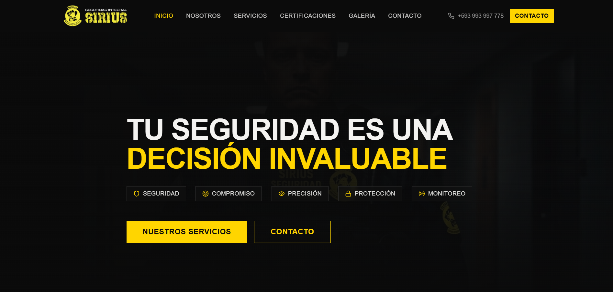
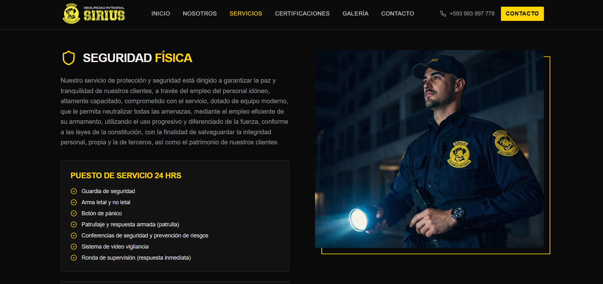
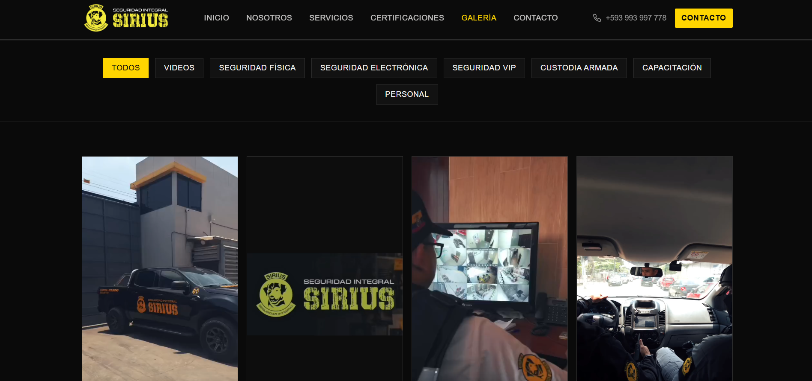
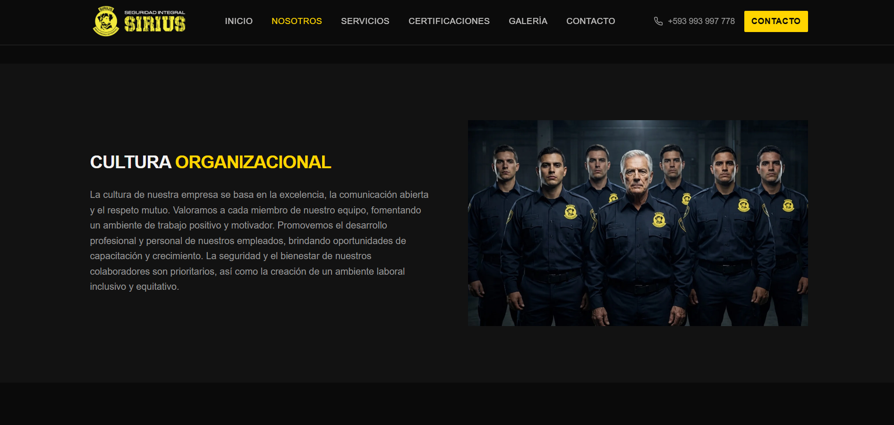
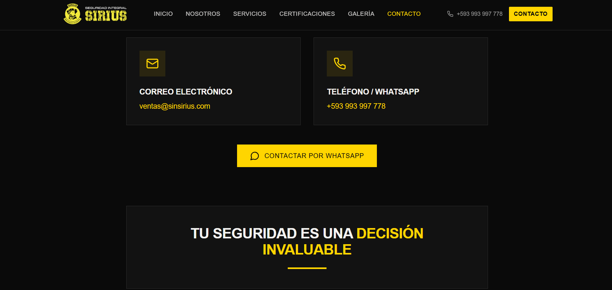
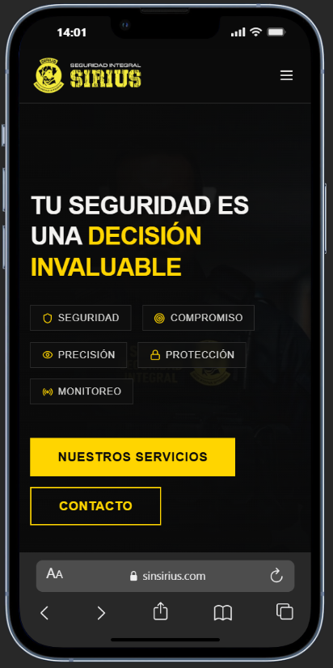

# SIRIUS Seguridad Integral — Sitio Web Corporativo

Sitio web institucional completo para empresa de seguridad privada en Ecuador, con catálogo de servicios, galería multimedia y canales de contacto directo.

---

## El problema que resuelve

Las empresas de seguridad suelen carecer de presencia digital profesional: sus clientes potenciales no encuentran información clara sobre qué servicios ofrecen, qué los diferencia, ni cómo contactarlos con urgencia. Este proyecto resuelve eso con un sitio enfocado en transmitir confianza, claridad y acción inmediata.

---

## Qué hace

| Funcionalidad | Beneficio real |
|---|---|
| Página de inicio con video hero | Primera impresión de alto impacto que comunica profesionalismo |
| Catálogo de 5 servicios detallados | El cliente entiende exactamente qué contratar sin necesidad de llamar |
| Sección Nosotros con misión y valores | Genera confianza institucional antes del primer contacto |
| Galería de fotos y videos operativos | Evidencia visual del trabajo real de la empresa |
| Página de certificaciones y convenios | Respaldo institucional visible que diferencia de la competencia |
| Contacto directo (email, teléfono, WhatsApp) | Reduce la fricción para convertir visitas en consultas |
| Diseño 100% responsive | Funciona correctamente en celular, tablet y escritorio |
| Animaciones de entrada fluidas | Experiencia visual premium que refuerza la imagen de la marca |

---

## Stack


---

## Capturas

| Vista | Screenshot |
|---|---|
| Hero — pantalla principal |  |
| Servicios — catálogo completo |  |
| Galería — fotos y videos |  |
| Nosotros — equipo y valores |  |
| Contacto |  |
| Mobile — vista responsive |  |

---

## Estado del proyecto

- [x] Sitio desplegable con Vite + React + TypeScript
- [x] Diseño dark theme con identidad visual de marca
- [x] Página de inicio con hero en video y secciones preview
- [x] Catálogo completo: Seguridad Física, Electrónica, VIP, Custodia Armada, Capacitación
- [x] Página Nosotros con misión, visión, valores y objetivos
- [x] Galería multimedia con lightbox para fotos y reproductor de video
- [x] Página de certificaciones y convenios institucionales
- [x] Página de contacto con email, teléfono y WhatsApp
- [x] Navegación con React Router (6 rutas)
- [x] Animaciones con Framer Motion en todas las secciones
- [x] Diseño totalmente responsive (mobile, tablet, desktop)
- [x] SEO básico: meta tags, Open Graph y Twitter Card configurados

---

## Setup técnico

<details>
<summary>Instrucciones de instalación y desarrollo</summary>

### Requisitos

- Node.js 18+
- npm o bun

### Instalación

```bash
# Clonar el repositorio
git clone https://github.com/FelipeQuirola/sirius-seguridad-web.git
cd sirius-seguridad-web

# Instalar dependencias
npm install

# Iniciar servidor de desarrollo
npm run dev
```

El servidor queda disponible en `http://localhost:8080`

### Scripts disponibles

```bash
npm run dev       # Servidor de desarrollo
npm run build     # Build de producción
npm run preview   # Preview del build
npm run lint      # Linting con ESLint
npm run test      # Tests con Vitest
```

### Estructura del proyecto

```
src/
├── assets/          # Imágenes estáticas
├── components/
│   ├── home/        # Secciones de la página principal
│   ├── layout/      # Header, Footer, Layout wrapper
│   └── ui/          # Componentes shadcn/ui
├── hooks/           # Custom hooks
├── lib/             # Utilidades
└── pages/           # Rutas: Index, Servicios, Nosotros, Galeria, Certificaciones, Contacto
public/
└── videos/          # Videos operativos (.mp4)
```

</details>

---

## Licencia

Copyright © 2026. Todos los derechos reservados.
